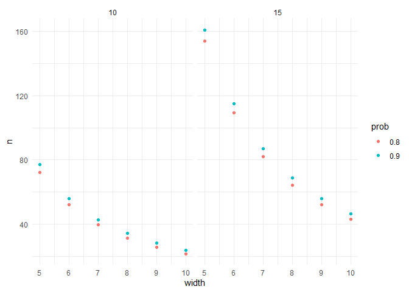
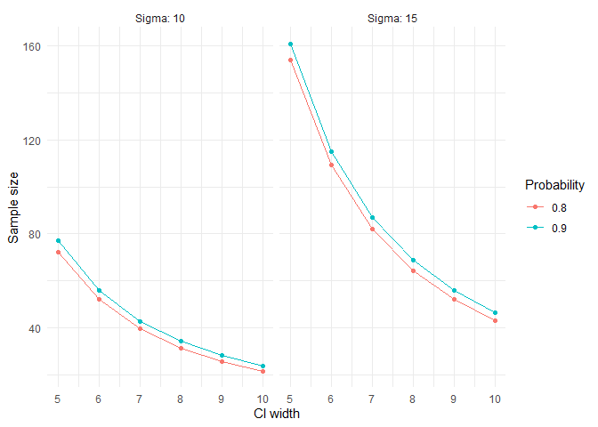

<!-- README.md is generated from README.Rmd. Please edit that file -->

# ciwidth

<!-- badges: start -->

<!-- badges: end -->

With `ciwidth` you can determine the sample size needed for obtaining
confidence intervals for means and mean differences which has a given
width with a given probability.

## Installation

You can install the development version of ciwidth from
[GitHub](https://github.com/) with:

``` r
# install.packages("devtools")
devtools::install_github("snhansen/ciwidth")
```

## Example

Let us calculate the sample sizes needed to obtain a 95% confidence
interval for a mean of width 5, 6, 7, 8 and 10 with a probability of
either 80% or 90% and a standard deviation of 10 or 15:

``` r
library(ciwidth)
ci_width_mean(sigma = c(10, 15), width = 5:10, prob = c(0.80, 0.90))
#> # A tibble: 24 × 5
#>    sigma width  prob     n conf.level
#>    <dbl> <int> <dbl> <dbl>      <dbl>
#>  1    10     5   0.8  72.3       0.95
#>  2    15     5   0.8 154.        0.95
#>  3    10     6   0.8  52.0       0.95
#>  4    15     6   0.8 109.        0.95
#>  5    10     7   0.8  39.6       0.95
#>  6    15     7   0.8  82.1       0.95
#>  7    10     8   0.8  31.4       0.95
#>  8    15     8   0.8  64.3       0.95
#>  9    10     9   0.8  25.8       0.95
#> 10    15     9   0.8  52.0       0.95
#> # ℹ 14 more rows
```

With the `plot`-argument, you can create a `ggplot2` figure:

``` r
ci_width_mean(sigma = c(10, 15), width = 5:10, prob = c(0.80, 0.90), plot = TRUE)
```



Since this is just a `ggplot2` figure, we can customize it afterwards:

``` r
library(ggplot2)
#> Warning: package 'ggplot2' was built under R version 4.4.3
fig <- ci_width_mean(sigma = c(10, 15), width = 5:10, prob = c(0.80, 0.90), plot = TRUE)
fig <- fig + 
  labs(x = "CI width", y = "Sample size", color = "Probability") + 
  facet_wrap(~ sigma, labeller = labeller(sigma = c("10" = "Sigma: 10", "15" = "Sigma: 15")))

fig
```


